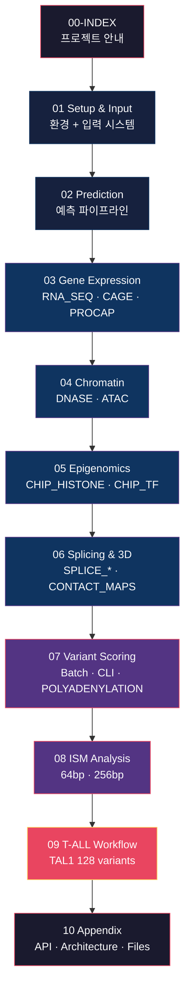

# AlphaGenome 튜토리얼 실행 상세 보고서

**작성일**: 2026년 2월 6일 | **모듈화**: 2026년 2월 10일
**실행 완료**: 7개 핵심 튜토리얼 + 5개 추가 스크립트
**OutputType 커버리지**: 11가지 전체 + POLYADENYLATION scorer

---

## 이 보고서가 답하려는 핵심 질문

1. **AlphaGenome은 DNA 서열에서 무엇을 예측하는가?** → 11가지 OutputType 전체 검증
2. **단일 변이가 유전체 기능에 미치는 영향을 어떻게 정량화하는가?** → Batch/CLI/ISM 세 가지 경로
3. **실제 질병 연구에 어떻게 적용할 수 있는가?** → T-ALL TAL1 128 variant 분석

---

## 보고서 구조



---

## 모듈 요약표

| # | 모듈 | 핵심 질문 | 주요 수치 | 파일 |
|---|------|----------|----------|------|
| **01** | [Setup & Input](01-setup-and-input.md) | 입력 시스템은 어떻게 구성되는가? | 5,559 ontology terms, 5,563 human tracks | `genome.Interval`, `genome.Variant`, Ontology |
| **02** | [Prediction](02-prediction.md) | 예측은 어떻게 수행되는가? | 6개 핵심 메서드, 1MB 입력 | `predict_*`, `score_*`, Batch 패턴 |
| **03** | [Gene Expression](03-gene-expression.md) | 유전자 발현은 어떻게 예측되는가? | RNA_SEQ 667, CAGE 546, PROCAP 12 tracks | GeneMaskLFCScorer |
| **04** | [Chromatin](04-chromatin.md) | DNA 접근성은 어떻게 측정되는가? | DNASE 305, ATAC 167 tracks | CenterMaskScorer |
| **05** | [Epigenomics](05-epigenomics.md) | 히스톤/TF 결합 상태는? | CHIP_HISTONE 1,116, CHIP_TF 1,617 tracks | K562/HepG2 분석 |
| **06** | [Splicing & 3D](06-splicing-and-3d.md) | RNA 처리와 3D 구조는? | SPLICE_SITES 4, SSU 734, SJ 367, CM 28 | Sashimi, ContactMaps |
| **07** | [Variant Scoring](07-variant-scoring.md) | 변이 효과를 어떻게 정량화하는가? | Batch 121,550행, CLI 38,357행 | 19 RECOMMENDED_VARIANT_SCORERS |
| **08** | [ISM Analysis](08-ism-analysis.md) | 연속 구간 전체를 어떻게 스캔하는가? | 192 (64bp) + 768 (256bp) variants | SeqLogo heatmap |
| **09** | [T-ALL Workflow](09-tall-workflow.md) | 실제 질병 연구에 어떻게 적용되는가? | 32 oncogenic (+0.334) vs 96 background (-0.020) | TAL1 locus |
| **10** | [Appendix](10-appendix.md) | API 상세 참조 | 7 메서드 시그니처, 10 results dirs | Architecture, File Manifest |

---

## 내러티브 흐름 (Bridge Chain)

각 모듈은 이전 모듈의 질문을 이어받아 다음 단계로 진행한다:

| 모듈 | 이어받는 질문 | 답한 후 남기는 질문 |
|------|-------------|-------------------|
| 01 → 02 | "환경 준비 완료" | "실제 예측은 어떻게 수행하는가?" |
| 02 → 03 | "파이프라인 이해 완료" | "유전자 발현 예측 결과는?" |
| 03 → 04 | "발현 확인" | "DNA 접근성은 어떠한가?" |
| 04 → 05 | "크로마틴 열림 확인" | "히스톤/전사인자 결합 상태는?" |
| 05 → 06 | "에피게놈 파악" | "RNA 처리와 3D 구조는?" |
| 06 → 07 | "11개 OutputType 완료" | "변이 효과를 어떻게 정량화하는가?" |
| 07 → 08 | "단일 변이 효과 측정" | "연속 구간 전체를 어떻게 스캔하는가?" |
| 08 → 09 | "ISM 매핑 완료" | "실제 질병 연구에 어떻게 적용하는가?" |
| 09 → 10 | "실전 사례 완료" | "API 상세 참조가 필요하다" |

---

## 핵심 수치 요약

| 항목 | 수치 |
|------|------|
| 총 변이 점수 행 (Batch) | 121,550 |
| 총 변이 점수 행 (CLI, 19 scorers) | 38,357 |
| POLYADENYLATION 점수 행 | 396 |
| ISM 변이 (64bp + 256bp) | 192 + 768 = 960 |
| T-ALL 분석 변이 | 128 (32 oncogenic + 96 background) |
| Human OutputTypes | 11 |
| Human tracks | 5,563 |
| Mouse tracks | 1,038 |
| Human ontology terms | 5,559 |
| 시각화 PNG | ~20+ |
| Scripts | 12 |
| Results 디렉토리 | 10 |

---

## 실행 환경

```
프로젝트 경로: /home/kyuwon/projects/alphagenome
Python: 3.11+ (uv-managed virtual environment)
참조 게놈: hg38 (GENCODE v46)
API: AlphaGenome gRPC Client (Google DeepMind)
주요 라이브러리: alphagenome, pandas, numpy, matplotlib, plotnine, anndata, tqdm
```

---

## 최종 결론

AlphaGenome API를 통해 **11가지 OutputType 전체**를 검증하고, **19개 RECOMMENDED_VARIANT_SCORERS**로 변이 효과를 정량화하며, **T-ALL 실제 질병 모델**에서 oncogenic variant (+0.334)와 background variant (-0.020)의 명확한 차이를 입증했다. 이 보고서는 각 단계의 입력-처리-출력을 재현 가능한 수준으로 기록한다.

---

> **읽는 순서**: 01부터 순서대로 읽는 것을 권장한다. 특정 주제만 참조할 경우 위 요약표에서 해당 모듈로 바로 이동할 수 있다.
